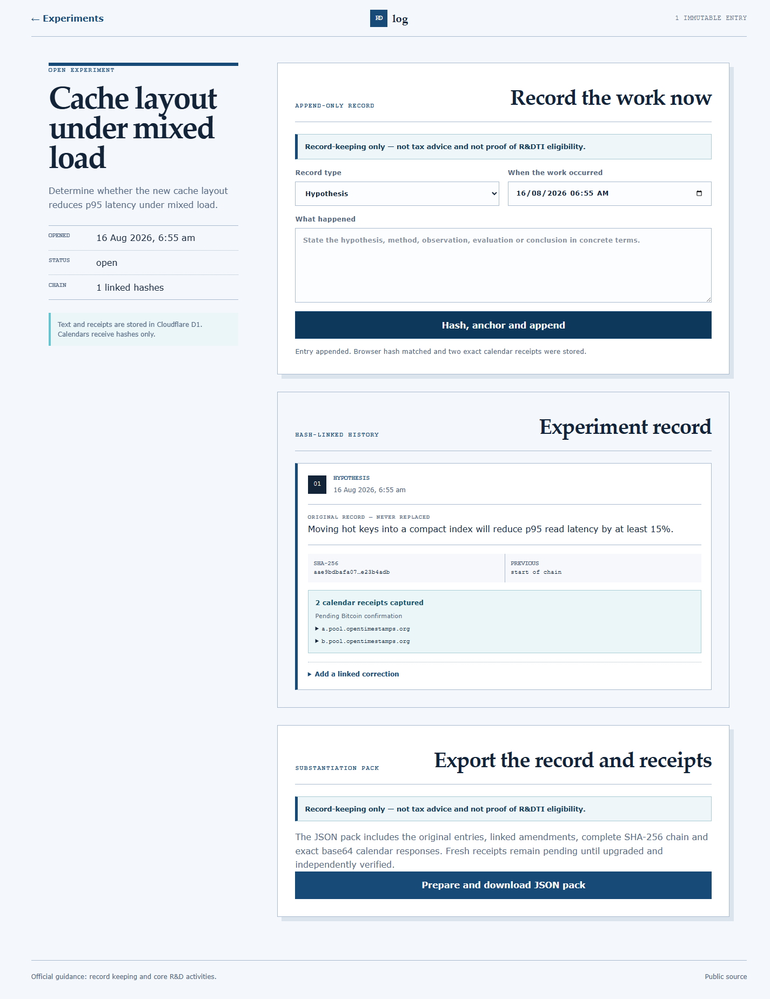

# Rdlog

Rdlog is a free, open-source record log for Australian teams documenting R&D Tax Incentive experiments while the work is happening. It is for founders, engineers and R&D leads who want one chronological record of the hypothesis, method or experiment, observations, evaluation, conclusion and project notes.

Each entry is append-only and SHA-256 hash-linked to the entry before it. Corrections are separately hashed amendments that leave the original visible. The browser submits each entry hash to two OpenTimestamps calendars and stores their exact base64 responses. A JSON substantiation pack exports the entries, amendments, chain and receipts together.

Rdlog is record-keeping software only. It does not provide tax advice, determine eligibility, prove that an activity qualifies, or carry endorsement from the ATO or the Department of Industry, Science and Resources.

## Why it exists

Australian Government guidance is direct:

> “Records should be created at the time the activity is conducted.”

Source: [Record keeping for the R&D Tax Incentive — business.gov.au](https://business.gov.au/grants-and-programs/research-and-development-tax-incentive/check-if-you-are-eligible-for-the-randd-tax-incentive/record-keeping-for-the-rd-tax-incentive)

The experiment fields also follow the official description of a systematic progression of work: [Conducting core R&D activities — business.gov.au](https://business.gov.au/grants-and-programs/research-and-development-tax-incentive/check-if-you-are-eligible-for-the-randd-tax-incentive/conducting-core-activities). Read the [ATO’s R&D Tax Incentive overview](https://www.ato.gov.au/businesses-and-organisations/income-deductions-and-concessions/incentives-and-concessions/research-and-development-tax-incentive-and-concessions) and obtain professional advice for a claim.

## Use it

- App: [https://s72-rdlog.pages.dev](https://s72-rdlog.pages.dev)
- API: [https://s72-rdlog-api.hello-campsitestudio.workers.dev](https://s72-rdlog-api.hello-campsitestudio.workers.dev)



## What the receipts mean

The two calendars receive a SHA-256 hash, not the experiment text. A saved calendar response shows that a calendar accepted that hash. A fresh response is pending: it must later be upgraded and independently verified against Bitcoin before making any Bitcoin timestamp claim. The hash chain can expose an altered export, but it does not prove that the words are true, that the recorded occurrence time is accurate, or that the activity is eligible for the R&D Tax Incentive.

## Privacy and security limits

- Experiment text, occurrence times, amendments, hashes and calendar receipts are stored in the shared `ship72` Cloudflare D1 database.
- A bearer workspace token is held in browser local storage. Anyone who can read that browser profile or token may be able to access the workspace. There is no account recovery flow.
- The OpenTimestamps calendars receive only entry hashes. They do not receive experiment text through Rdlog.
- The app and API expose an append-only workflow, but this is not immutable storage against a database operator or compromised infrastructure.
- The export contains the record content. Store and share it as sensitive business material.
- There is no email path, so the project does not depend on a verified mail domain.

Do not enter information you are not authorised to store with Cloudflare or disclose in an export. Review your organisation’s retention, access and confidentiality requirements before adopting the tool.

## Local setup

Run the second and third commands in separate PowerShell terminals from the repository root. The second command creates the local D1 tables before starting the API.

```powershell
pnpm install
pnpm exec wrangler d1 execute ship72 --local --config apps/rdlog/api/wrangler.jsonc --file apps/rdlog/migrations/0001_rdlog.sql; pnpm exec wrangler dev --config apps/rdlog/api/wrangler.jsonc --var SESSION_SIGNING_SECRET:local-rdlog-session-secret-change-me --var WEB_ORIGIN:http://localhost:5173
$env:VITE_API_URL="http://localhost:8787"; pnpm --filter @ship72/rdlog-web dev
```

## Alternatives considered

eLabFTW is a capable free general-purpose electronic lab notebook. MiracleMint provides free Australian R&D templates. Rand advertises a free first month. At the time of the competitor review, none combined this tax-specific entry structure with an append-only hash chain, two retained calendar responses and one JSON export. Recheck those products before relying on this comparison.

## Support

This is a solo-built project. GitHub issues are reviewed and usually receive a reply within a few days; there is no guaranteed response time or tax support.

Cloudflare Web Analytics is not enabled because the current account token cannot create an analytics site. The frontend accepts `VITE_CF_WEB_ANALYTICS_TOKEN`; the owner can enable Web Analytics in Cloudflare and redeploy with that token.

## Licence

MIT. See [LICENCE.md](LICENCE.md).
